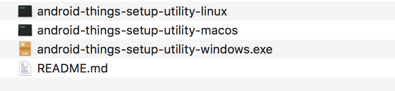

# Android Things Console

https://partner.android.com/things/console/

## Setup Utility

https://partner.android.com/things/console/u/0/?pli=1#/tools



## Android Things Update

OSXは、AndroidSDK¥platform-toolsにパスを通しておく。

```
vi ~/.bash_profile
```

```
...
export ANDROID_TOOL=/Users/akira/Library/Android/sdk/platform-tools
...
export PATH=$PATH:$ANDROID_TOOL
```

```
source ~/.bash_profile
```

```
echo $PATH
```

OSX
```
$ sudo android-things-setup-utility
```

Windowsは管理者の権限で、android-things-setup-utility.exe を実行


## flash-all.shでのインストール

```
$ adb reboot bootloader
```

Fastboot modeで

```
$ flash-all.sh
```

